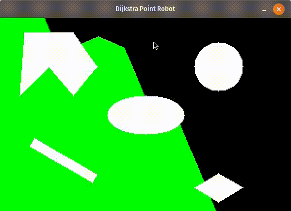

# Path Planning with Djikstra
This repository has code files for navigation of point robot and rigid robots using Dijkstra algorithm. 

## Introduction
Djikstra algorithms generates the shortest path by adopting a greedy algorithm. It calculates the minimum vertex from the source and identifies the 

## Prerequisites
The programs uses numpy, pygame ,time and math libraries. Hence, these libraries should be pre-installed. 

## Demo Steps
1.  Open Terminal 
2.  Navigate to the extraced folder or git clone from the repo
3.  Run the command for the python program
    - ```python pointRobot.py``` for Point Robot
    - ```python rigidRobot.py``` for Rigid Robot
4. Enter Start point and End point
5. (Only for Rigid Robot) Enter radius and Clearance of the rigid robot

## Results

Demo result for Point Robot from source (0,0) to (300,200)



Demo result for Point Robot from source (0,0) to (300,200)


## Notes 
Time taken for the point robot to move from (0,0) to (300,200) using Djikstra =  315.653 sec (Calculated using Time package python)

## Authors
Shivam Akhauri  
Raghav Agarwal