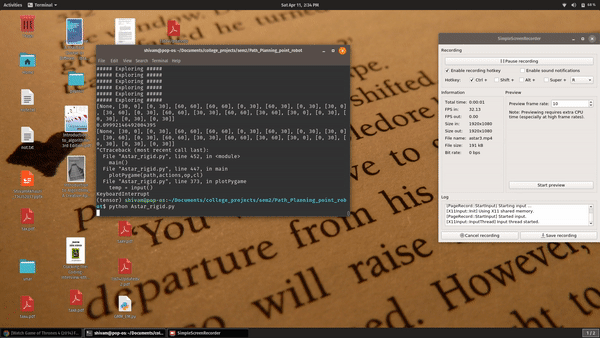

# Path Planning with Astar
This repository has code files for rigid robots using AStar algorithm. 

## Introduction
A* is an informed search algorithm, meaning that it is formulated in terms of weighted graphs: starting from a specific starting node of a graph, it aims to find a path to the given goal node having the smallest cost. It does this by maintaining a tree of paths originating at the start node and extending those paths one edge at a time until its termination criterion is satisfied

## Prerequisites
The programs uses numpy, pygame ,time and math libraries. Hence, these libraries should be pre-installed. 
To install Numpy : pip install numpy
To install pygame : pip install pygame

## Demo Steps
1.  Open Terminal 
2.  Navigate to the extraced folder or git clone from the repo
3.  Run the command for the python program
    - ```python Astar_rigid.py``` 
4. Enter Clearance of the rigid robot
5. Enter Start point and End point, initial robot orientation(theta) 

## Results

Demo result attached is from source (-4,-4,0) to (4,4) 
,clearance=0.1




## Authors
Shivam Akhauri  
Raghav Agarwal
