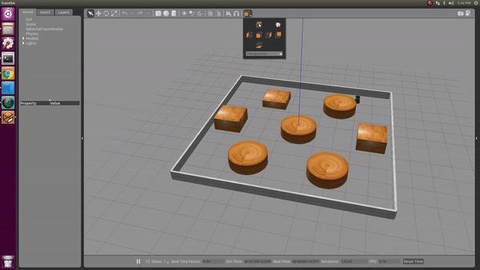
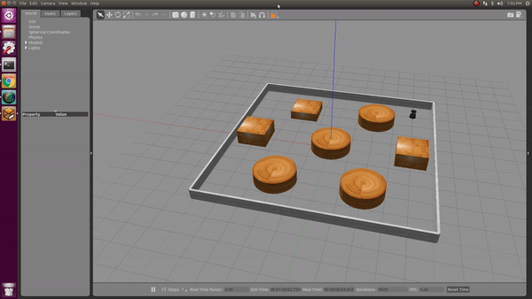

# AStar Differential drive robot

## Overview
This project involves a turtlebot which moves around the maze based on the trajectory given by the Astar algorithm. The turtlebot receives the start point and the end point and the wheel rpm's and calculates its trajectory based on the Astar algorithm, given the clearance from the obstacles and uses differntial drive equations to perform the actions as obtained from astar.

## Pre- Requisites:
1. Ros Kinetic
2. Turtle bot installation: 

```
sudo apt-get install ros-kinetic-turtlebot-gazebo 
ros-kinetic-turtlebot-apps ros-kinetic-turtlebot-rviz-launchers
```

3. Catkin
4. Gazebo

## Installation :
```
1. git clone --recursive "https://github.com/shivamakhauri04/Planning.git". The repo is named "proj3_40_python". 
2. cp <path to repository> <catkin_workspace/src/>
3. cd <catkin_workspace>
```

## Demo Steps
1. cd <catkin_workspace/>
2. source devel/setup.bash
3. ROBOT_INITIAL_POSE="-x -4 -y -4 -Y 0 " roslaunch roombarobotvacuumcleaner roomba.launch xInitial:=-4 yInitial:=-4 theta:=0 xFinal:=4 yFinal:=4 lw:=30 rw:=60. Here change '-x' and '-y' based on where the turtlebot has to Start. Same value has to be given for "xInitial" and "yInitial". xFinal and yFinal define the "goal" point of the turtlebot."lw" and "rw" define the left wheel rpm and the right wheel rpm. 'theta' is the initial orintation of the robot and same has to be entered for Y 
4. press Ctrl+C to end roslaunch

## Results

Demo result attached is from source (-4,-4,0) to (4,4) , left wheel rpm 30 , right wheel rpm 60



Demo result attached is from source (-4,-4,0) to (0,-3) , left wheel rpm 30 , right wheel rpm 60




