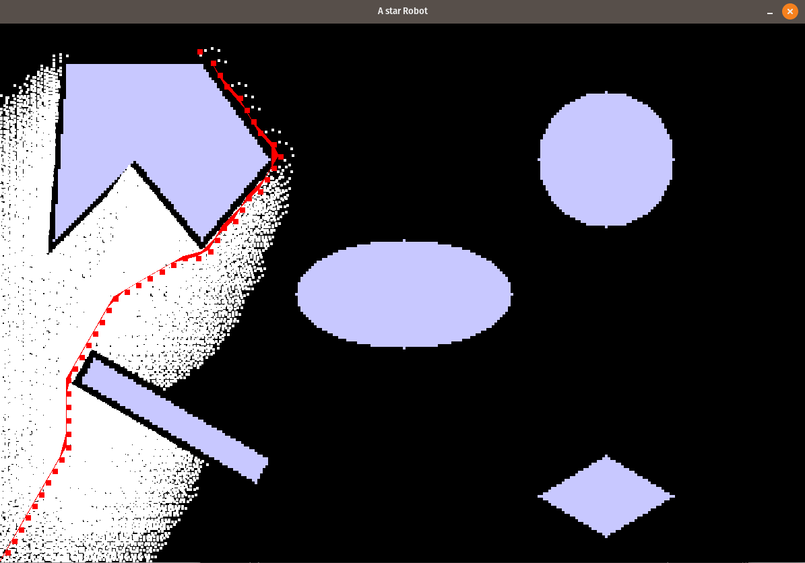

# Path Planning with Astar
This repository has code files for rigid robots using AStar algorithm. 

## Introduction
A* is an informed search algorithm, or a best-first search, meaning that it is formulated in terms of weighted graphs: starting from a specific starting node of a graph, it aims to find a path to the given goal node having the smallest cost. It does this by maintaining a tree of paths originating at the start node and extending those paths one edge at a time until its termination criterion is satisfied

## Prerequisites
The programs uses numpy, pygame ,time and math libraries. Hence, these libraries should be pre-installed. 

## Demo Steps
1.  Open Terminal 
2.  Navigate to the extraced folder or git clone from the repo
3.  Run the command for the python program
    - ```python Astar_rigid.py``` 
4. Enter Start point and End point, Movement step Size and initial robot orientation
5. Enter radius and Clearance of the rigid robot

## Results

Demo result for Point Robot from source (0,0) to (75,190) for step size = 5, radius = 1, step_size = 5 



## Notes 
Time taken for the point robot to move from (0,0) to (300,200) using Astar for the given Action set =  315.653 sec (Calculated using Time package python)

## Authors
Shivam Akhauri  
Raghav Agarwal
